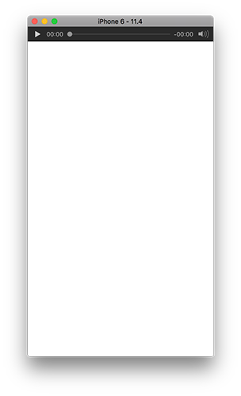

# ReactNative Audio Player #

ReactNative Audio lib for IOS

- Support for local files (AAC, MP3 etc)
- Support for network files (AAC, MP3 etc)
- Support for steaming (Ice/Shoutcast, HLS etc) 
- Support for Airplay / Now playing Info on lockscreen 





## Installation ##

First install the npm package from your app directory:

```
    npm install pbplayer --save
```

Then link it automatically using:

```
    react-native link pbplayer
```


## Usage ##

**Component based**

Add on top of component file:

```
    import {AudioPlayer} from 'pbplayer';
```


Add in component render function:

```
    <Audio 
        src="https://example.nl/stream" 
        artist="Denny Lau"
        title="Dennies Sing a Long"
        album="Dennies album"
        cover="https://example.com/thumb.png"
    />
```

**OR**

In a JS class function:

```
 let    player = new Audio();
        player.src = 'https://example.com/fragment.aac';
        player.canplay = () => {
            player.play();
        }
            
        player.ended = () => {
            this.player.currentTime = 0;
            this.setState({
                isPlaying: false,
            });
        }
        
        player.timeupdate = ( cTime ) => {
            if(player) {
                this.setState( {
                    duration: this.player.duration,
                    value: this.state.isSeeking ? this.state.value : (cTime || 0),
                });
            }
        }
```


```
    player.pause() 
```

## Todo ##
- Cleanup
- Android support

## Need some help? ##
Follow me on Twitter @dennis_pluxbox


## Contributing ##
Of course! I'm waiting your PR :) 


